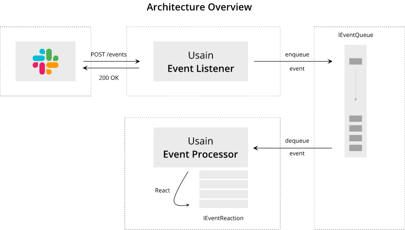
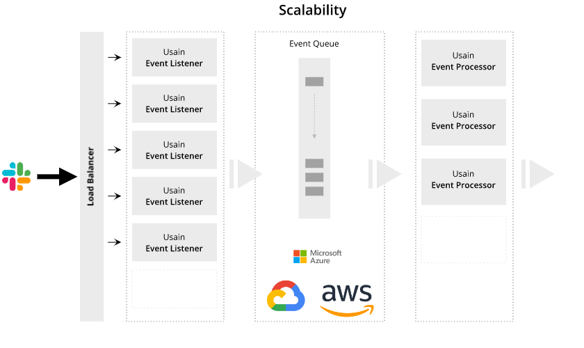

  

<h1 align="center">
  Usain
</h1>

<h4 align="center">A simple, fast and scalable Slack events server for .NET</h4>

# Introduction

There are plenty of existing Slack integration frameworks. Slack engineering team even provide its own implementation with Bolt (JS, Java).\
However, while trying to integrate Slack using a .NET Core stack, i didn't find any project that was simple to use, while being fast and scalable...

Usain is simple, fast and scalable.

It provides the event ingesting and processing infrastructure you need to create an reactive (interactive) Slack App.

  

## Simple

Usain addresses only two concerns:

- Ingesting your slack event as fast as possible.
- Processing each and every ingested event in a customizable and reliable way.

This limitation of concerns enforce simplicity.

Adding an _Event Reaction_ (how to react to a Slack event) is as simple as providing an implementation of the `IEventReaction<>` to the Dependency Injection container. This _Event Reaction_ will be automatically used by the _Event Processor_ pipeline.

Head down to the [Getting started](#Getting-started) section to learn how to implement an EventReaction.

## Fast

### ASP.NET Core

ASP.NET Core is fast, really fast.

According to [Tech Empower Benchmarks] ìt is one of the fastest web stack on the market as of today (jun 2020). Surprisingly it is even faster than a pure Rust or C++ web server. This is probably due to a lack of maturity in these implementations. That said, in term of pure raw performance, ASP.NET Core is at light years from a Node or Java web stack, which would probably be your choice if you had to use the genuine Slack SDK (Bolt).

### MVC free

Usain is built upon raw ASP.NET Core.

It does not use ASP.NET Core MVC. This saves us from the extra overhead of the MVC pipeline.

### System.Text.Json

Usain uses [System.Text.Json] for Json serialization operations.

`System.Text.Json` design emphasizes high performance and low memory allocation over an extensive feature set. Built-in UTF-8 support optimizes the process of reading and writing JSON text encoded as UTF-8, which is the most prevalent encoding for data on the web and files on disk.

 ### LoggerMessage

 Usain uses [LoggerMessage](https://docs.microsoft.com/en-us/aspnet/core/fundamentals/logging/loggermessage?view=aspnetcore-3.1) for logging operations.

 LoggerMessage creates cacheable delegates that require fewer object allocations and reduced computational overhead compared to logger extension methods, such as LogInformation and LogDebug. It is the recommended pattern for high-performance logging scenarios.

## Scalable

### De-coupled events ingestion and reaction
As recommended by Slack, event ingestion and processing should de-coupled. Slack server expects your event ingestion to be fast and error free otherwise it will block your endpoint and stop sending events. You don't want that to happen in a production scenario.

Usain has been designed to follow that recommendation from the ground up. It uses an intermediate Event Bus abstraction to de-couple event ingestion from event reaction.

We provide a default in-memory implementation for basic scenarios, but swapping this default for something more scalable is a matter of a single line of configuration.

  

### Extensible and flexible

Usain is extensible in almost every area of the Event ingestion and processing pipeline.

There again, we provide a substitutable default implementations you can swap for whatever your consider a better fit for your use cases or infrastructure requirements.

Internally, Event handlings use a mediated event design. This gives you a lot more flexibility when implementing your business workflows.

## Usain ? 🏃

In reference to Bolt, the Slack integration framework ([Bolt JS], [Bolt Java]).

Yes, you got it, Usain vs Bolt. Uhm... 🙄

# Getting started

To be completed.

Meanwhile, jump to the sample sources:

- [Single Webhost](./samples/01.single_webhost): demonstrates how to use both the Event Listener and the Event Processor infrastructure components inside a single webhost (Asp.Net Core). It uses an in-memory shared event queue. Not as scalable as the Tiered hosts sample but easier to start with.
- Tiered hosts: demonstrates how to host the Event Listener and the Event Process separately, allowing better horizontal scalability.

# Attributions

Usain icons made by [Pixel perfect] from [FlatIcon]

[Tech Empower Benchmarks]: <https://www.techempower.com/benchmarks/#section=data-r19&hw=ph&test=plaintext>
[System.Text.Json]: <https://docs.microsoft.com/en-us/dotnet/standard/serialization/system-text-json-overview>
[LoggerMessage]: <https://docs.microsoft.com/en-us/aspnet/core/fundamentals/logging/loggermessage?view=aspnetcore-3.1>
[Bolt JS]: <https://slack.dev/bolt-js/tutorial/getting-started>
[Bolt Java]: <https://slack.dev/java-slack-sdk/guides/getting-started-with-bolt>
[FlatIcon]: <http://www.flaticon.com/>
[Pixel perfect]: <https://www.flaticon.com/authors/pixel-perfect>
